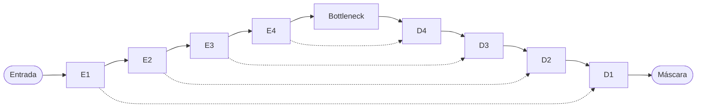

# Segmentação de Tumores em Ultrassom com U-Net (Julia)

Este projeto usa **visão computacional** e a arquitetura **U-Net** para identificar automaticamente a região de tumor em imagens de ultrassom da mama (dataset [BUSI](docs/material/Dataset_BUSI_with_GT/)).

A ideia é simples de explicar:

- **Entrada:** uma imagem de ultrassom em escala de cinza (por exemplo, `malignant (1).png`)
- **Saída:** uma máscara binária (por exemplo, `malignant (1)_mask.png`), onde o branco marca o tumor e o preto marca o restante

> **Aviso importante:** este é um projeto educacional de programação e aprendizado de máquina. **Não use como diagnóstico médico.**

---

## O que é a U-Net? (em linguagem humana)

Imagine que você precisa desenhar o contorno de um tumor em uma foto:

1. **Encoder (caminho de compressão):** a rede “olha a imagem de longe”, reduzindo o tamanho para entender padrões gerais (texturas, formas, bordas).
2. **Decoder (caminho de expansão):** depois ela “aproxima o zoom” de volta ao tamanho original para desenhar pixel a pixel onde está o tumor.
3. **Skip connections:** atalhos que ligam camadas do encoder ao decoder, ajudando a preservar detalhes finos das bordas.

O formato da arquitetura lembra a letra **U** — daí o nome **U-Net**:



Mais detalhes (dimensões, canais e blocos) em [docs/guia-unet.md](docs/guia-unet.md).

---

## Pré-requisitos

- [Julia](https://julialang.org/) **1.10+** (testado com 1.12.6)
- Dataset BUSI em `docs/material/Dataset_BUSI_with_GT/` (já presente no material do curso)

---

## Instalação

Na raiz do repositório:

```bash
julia --project -e "using Pkg; Pkg.instantiate()"
```

Na primeira execução, o Julia baixa e compila as dependências (Flux, Images, etc.). Isso pode levar alguns minutos.

Se o comando terminar **sem mensagem de erro**, a instalação deu certo. Para confirmar:

```bash
julia --project -e "using TumorSegmentation; println(:OK)"
```

Deve imprimir `OK`. Se aparecer erro, rode `Pkg.instantiate()` de novo e aguarde a compilação terminar.

---

## Modo fácil: interface web

Se você prefere **não decorar comandos**, use a interface no navegador:

### Opção A — duplo clique (Windows)

1. Instale as dependências uma vez (seção [Instalação](#instalação) acima).
2. Dê **duplo clique** em [`run.bat`](run.bat) na raiz do projeto.

   O arquivo `run.bat` já vem no repositório. Se não existir na sua cópia, crie na raiz com este conteúdo:

   ```bat
   @echo off
   cd /d "%~dp0"
   echo Abrindo interface web do projeto U-Net...
   julia --project -t auto scripts/interface.jl
   pause
   ```

3. O navegador abrirá em `http://127.0.0.1:8765/`.

### Opção B — um comando no terminal

```bash
julia --project -t auto scripts/interface.jl
```

O flag `-t auto` usa várias threads do CPU para o treino rodar em segundo plano sem travar a barra de progresso na página.

Na interface você pode:

- **Treinar** o modelo (com opção de treino rápido para testar)
- **Gerar máscara** escolhendo uma imagem do dataset na lista
- **Avaliar** e ver métricas Dice, IoU e acurácia

Os comandos de terminal abaixo continuam disponíveis para quem quiser usá-los.

---

## Como treinar o modelo

```bash
julia --project scripts/train.jl
```

O script vai:

1. Carregar imagens e máscaras das pastas `benign`, `malignant` e `normal`
2. Dividir em treino (70%), validação (15%) e teste (15%)
3. Treinar a U-Net por até 30 épocas (configurável)
4. Salvar o melhor modelo em `outputs/checkpoints/best_model.bson`

### Configuração

Edite [config/default.toml](config/default.toml) para ajustar:

| Parâmetro | Padrão | Descrição |
|-----------|--------|-----------|
| `epochs` | 30 | Número máximo de épocas |
| `batch_size` | 4 | Tamanho do lote |
| `learning_rate` | 0.001 | Taxa de aprendizado |
| `image_size` | 256 | Redimensionamento das imagens |
| `max_samples_per_class` | 0 | Limite por classe (0 = todas) |

Para um teste rápido, você pode definir `max_samples_per_class = 20` e `epochs = 5`.

---

## Como gerar uma predição

Depois do treino:

```bash
julia --project scripts/predict.jl --image "docs/material/Dataset_BUSI_with_GT/malignant/malignant (1).png"
```

Saídas geradas em `outputs/predictions/`:

- `malignant (1)_pred.png` — máscara prevista pelo modelo
- `malignant (1)_comparison.png` — comparação visual (entrada | predição | máscara real), se a máscara existir

---

## Como avaliar no conjunto de teste

```bash
julia --project scripts/evaluate.jl
```

Métricas exibidas:

- **Dice** — sobreposição entre predição e máscara real (quanto mais perto de 1, melhor)
- **IoU** — interseção sobre união
- **Acurácia pixel** — percentual de pixels corretos

---

## Executar os testes automatizados

```bash
julia --project test/runtests.jl
```

Os testes usam dados sintéticos e não exigem o dataset completo no CI.

---

## Estrutura do projeto

```
├── config/default.toml          # Hiperparâmetros
├── src/
│   ├── TumorSegmentation.jl     # Módulo principal
│   └── TumorSegmentation/       # Código-fonte organizado por responsabilidade
│       ├── dataset.jl           # Carregamento do BUSI
│       ├── unet.jl              # Arquitetura U-Net
│       ├── train.jl             # Treinamento
│       └── predict.jl           # Inferência
├── scripts/                     # Scripts de linha de comando
├── test/                        # Testes automatizados
├── docs/
│   ├── guia-unet.md             # Explicação da U-Net
│   ├── guia-julia.md            # Conceitos Julia usados
│   └── material/                # Material do curso (não alterado)
└── outputs/                     # Modelos e predições (gerado em runtime)
```

---

## Sobre o dataset BUSI

| Pasta | Conteúdo | Máscara esperada |
|-------|----------|------------------|
| `benign/` | Tumor benigno | Região branca no tumor |
| `malignant/` | Tumor maligno | Região branca no tumor |
| `normal/` | Sem tumor | Imagem totalmente preta |

Convenção de nomes: `classe (N).png` e `classe (N)_mask.png`.

---

## Material do curso

Os laboratórios originais com implementação manual da U-Net estão em:

- [docs/material/Laboratorios_U_Net/](docs/material/Laboratorios_U_Net/)

Este projeto usa **Flux.jl** (abordagem moderna), mas o material do curso continua válido para entender a matemática por trás das camadas convolucionais.

---

## Documentação adicional

- [Guia da U-Net](docs/guia-unet.md)
- [Guia de Julia para iniciantes](docs/guia-julia.md)

---

## Licença

MIT — veja [LICENSE](LICENSE).
