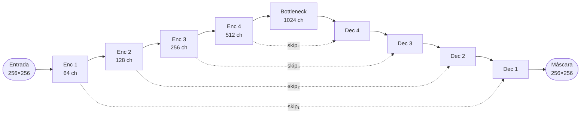
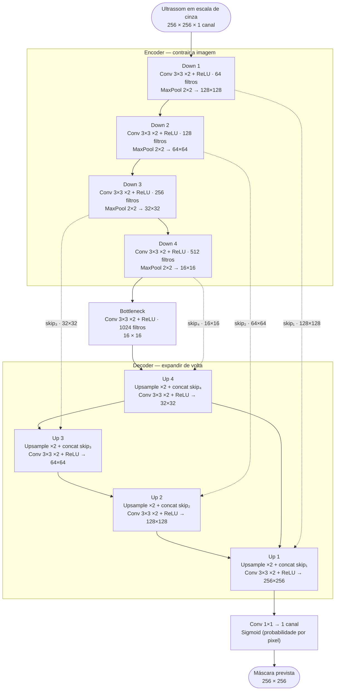

# Guia da U-Net — entenda sem medo

Este guia explica, em português simples, o que a U-Net faz neste projeto e por que ela é usada para segmentar tumores em ultrassom.

---

## O problema que estamos resolvendo

Em uma imagem de ultrassom, o tumor pode aparecer como uma região mais escura ou com textura diferente do tecido ao redor.

O desafio é: **para cada pixel da imagem, decidir se ele pertence ao tumor ou não**.

Isso é chamado de **segmentação semântica** (classificação pixel a pixel).

---

## Por que não usar uma rede “comum” de classificação?

Uma rede que só diz “tem tumor” ou “não tem tumor” não nos dá a **localização**.

Precisamos de uma saída com o **mesmo tamanho da imagem de entrada**, onde cada pixel tem um valor (0 = fundo, 1 = tumor).

A U-Net foi criada exatamente para isso.

---

## Anatomia da U-Net (formato em U)

### Visão geral — o desenho em “U”

Cada nível do **encoder** reduz a resolução e guarda um **skip** (linha tracejada). O **decoder** sobe de volta e **concatena** esses skips para recuperar bordas finas:

As setas tracejadas formam o “U”: informação de alta resolução do encoder volta direto para o decoder.

### Detalhe de cada bloco (implementação deste projeto)

| Parte | O que faz neste projeto |
|-------|-------------------------|
| **Conv 3×3 ×2** | Duas convoluções com ReLU — extrai bordas e texturas |
| **MaxPool 2×2** | Divide altura e largura pela metade |
| **Skip** | Saída do bloco convolucional *antes* do pool, concatenada no decoder |
| **Upsample ×2** | Dobra altura e largura (vizinho mais próximo) |
| **Conv 1×1 + Sigmoid** | Um filtro por pixel → probabilidade de tumor (0 a 1) |

Código correspondente: [`src/TumorSegmentation/unet.jl`](../src/TumorSegmentation/unet.jl).

### Encoder (contrair)

- Aplica convoluções para extrair características (bordas, texturas).
- Usa **max pooling** para reduzir a resolução (ex.: 256×256 → 128×128).
- Repete em vários níveis.

### Decoder (expandir)

- Usa **upsampling** para aumentar a resolução de volta.
- **Concatena** (`cat`) as ativações do encoder correspondente (skip connection).
- Aplica novas convoluções para refinar os contornos.

### Skip connections (atalhos)

Sem os atalhos, o decoder “esqueceria” detalhes finos ao comprimir a imagem.

Os atalhos levam informação de alta resolução do encoder direto para o decoder.

---

## O que acontece neste projeto, passo a passo

1. **Leitura:** carregamos `malignant (1).png` e `malignant (1)_mask.png`.
2. **Pré-processamento:**
   - converter para escala de cinza;
   - redimensionar para 256×256;
   - normalizar pixels para o intervalo [0, 1];
   - binarizar a máscara (0 ou 1).
3. **Treino:** a U-Net aprende a prever a máscara a partir da imagem.
4. **Inferência:** dada uma nova imagem, geramos `*_pred.png`.

---

## Por que redimensionar para 256×256?

As imagens do BUSI têm tamanhos diferentes. A nossa implementação usa camadas de pooling que dividem a dimensão por 2 várias vezes.

Tamanhos múltiplos de 16 ou 32 (como 256) evitam erros de shape e facilitam o treino em lote.

---

## Por que imagens `normal` têm máscara preta?

Na pasta `normal`, não há tumor. A anotação correta é: **nenhum pixel é tumor**.

Por isso a máscara é inteiramente preta (todos os pixels = 0).

O modelo aprende também a não “inventar” tumores nessas imagens.

---

## Função de perda (loss) usada

Combinamos duas medidas:

| Loss | O que mede |
|------|------------|
| **Binary Cross-Entropy (BCE)** | Erro pixel a pixel entre predição e verdade |
| **Dice Loss** | Quão bem as regiões se sobrepõem (útil quando o tumor é pequeno) |

---

## Métricas de avaliação

### Dice (F1 espacial)

Mede a sobreposição entre predição e máscara real.

- **1.0** = predição idêntica à máscara
- **0.0** = nenhuma sobreposição

### IoU (Intersection over Union)

Similar ao Dice, muito usada em segmentação.

### Acurácia de pixel

Percentual de pixels classificados corretamente.

> Em imagens `normal` (máscara toda preta), a acurácia pode parecer alta mesmo com predições medíocres. Por isso o **Dice** é mais informativo para tumores pequenos.

---

## Glossário rápido

| Termo | Significado |
|-------|-------------|
| **Pixel** | menor unidade da imagem |
| **Máscara** | imagem de saída desejada (ground truth) |
| **Segmentação** | dividir a imagem em regiões |
| **Convolução** | operação que detecta padrões locais (bordas, texturas) |
| **Pooling** | reduz resolução mantendo informação importante |
| **Época** | uma passagem completa pelo conjunto de treino |
| **Batch** | grupo de imagens processadas juntas |

---

## Referência original

Ronneberger, O., Fischer, P. & Brox, T. (2015). **U-Net: Convolutional Networks for Biomedical Image Segmentation.**

---

## Relação com o material do curso

Em [docs/material/Laboratorios_U_Net/Lab3.jl](../material/Laboratorios_U_Net/Lab3.jl), a U-Net é montada manualmente com matrizes e retropropagação.

Neste projeto, a **mesma ideia arquitetural** é implementada com **Flux.jl**, que calcula gradientes automaticamente — mais prático para treinar com centenas de imagens.
